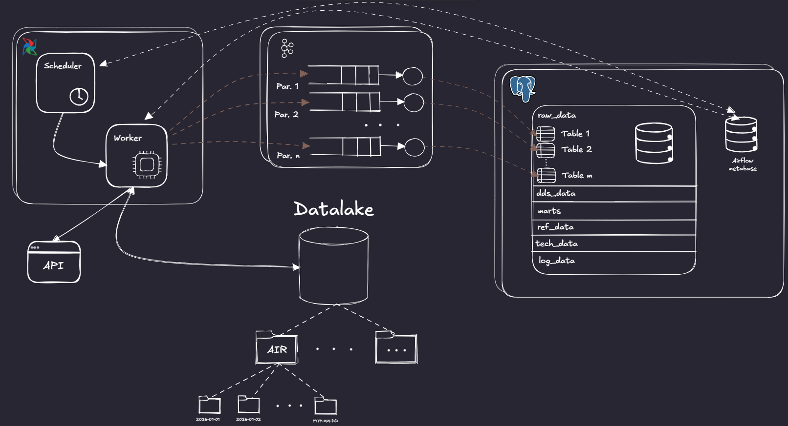
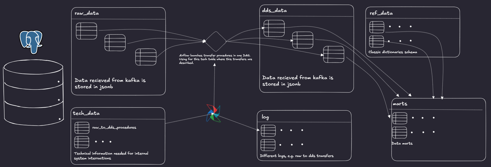

# airplane
Practice of kafka, clickhouse, airflow and performance analysis with data from airplanes flights

# Versions

Specified in .env.example file

# General Architecture

# Database Physical/Logical Scheme

